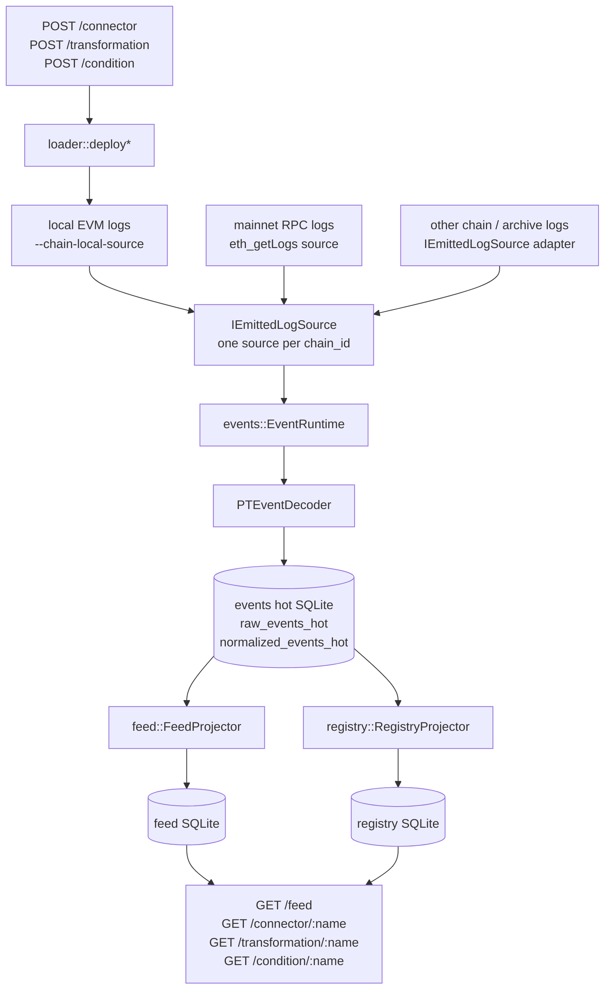
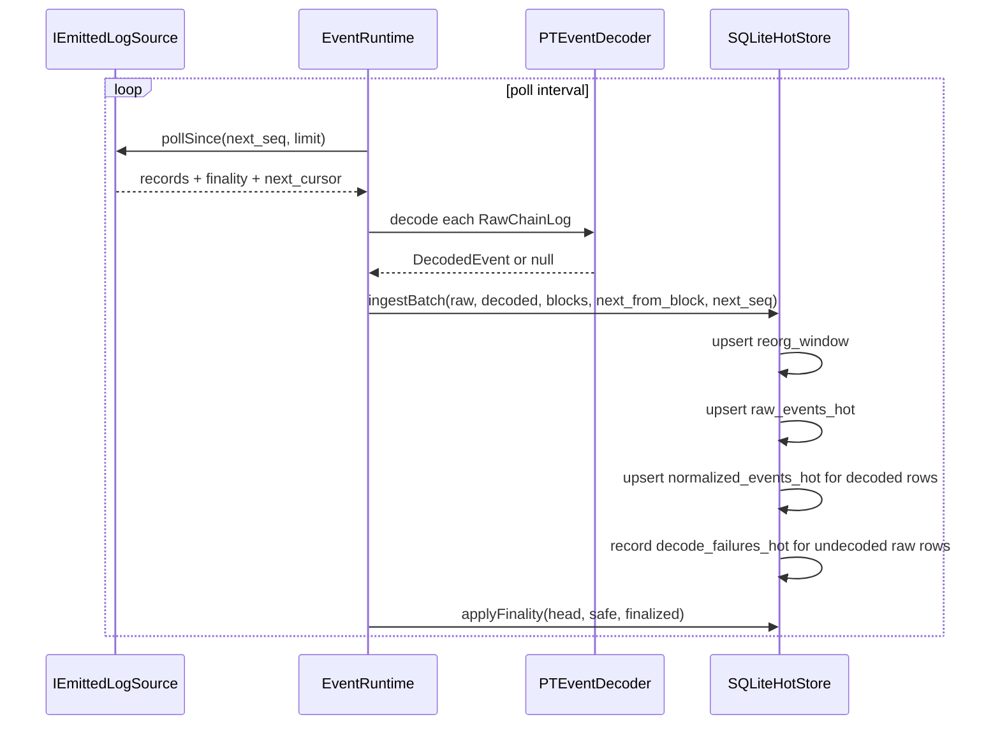
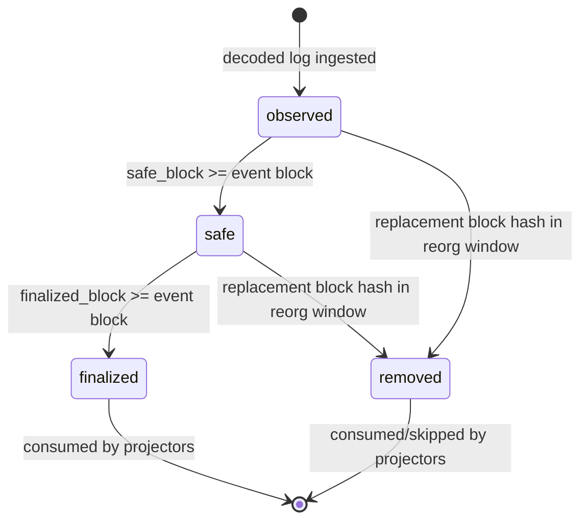
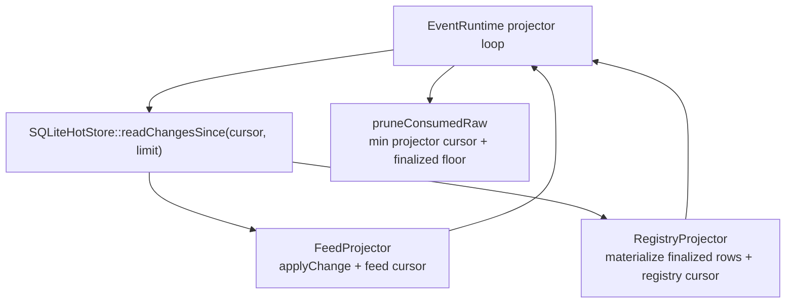
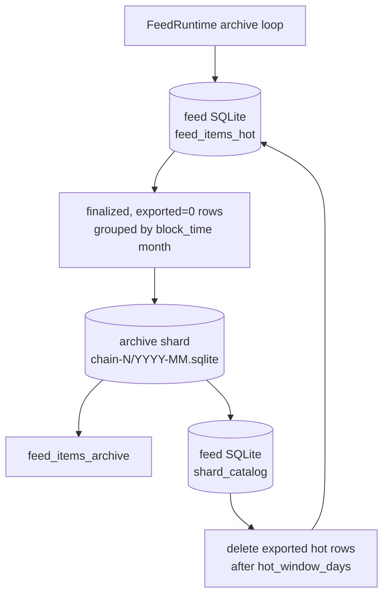
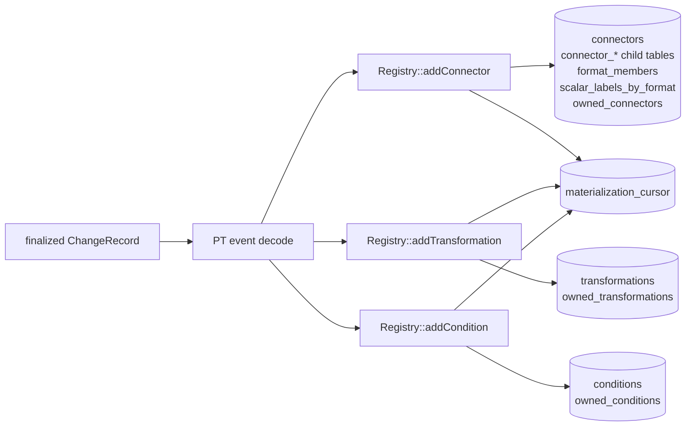

# Events Pipeline

The events module is the ingestion and projection layer for PT registry activity.
It turns PT `ConnectorAdded`, `TransformationAdded`, and `ConditionAdded` logs into
durable hot-store rows, then projectors materialize those rows into the feed and
registry databases.

## Runtime Wiring

`main.cpp` wires projectors before `EventRuntime::start()`. `FeedProjector` runs
first in each projector loop, then `RegistryProjector`. POST handlers deploy to
the EVM and return `201 Created` immediately: the chain-derivable response fields
come straight from the deploy — the connector `format_hash` is read back from the
emitted `ConnectorAdded` log, and `args_count` from the transformation/condition
record — so the response neither waits for nor depends on the registry projector
or ingestion being enabled. The projectors materialize the entity asynchronously,
so the `GET` read endpoints only reflect it once the event finalizes (and, with
ingestion disabled, never do). Each event source plugs
in through `IEmittedLogSource`; the current runtime wires `LocalEvmSource` for
`--chain-local-source`, and the same interface is the path for RPC/archive
sources. The runtime rejects duplicate sources for the same `chain_id` because
the hot store has one ingestion cursor per chain.

## Event Types

| PT event | Internal type | Decoder | Registry materialization |
| --- | --- | --- | --- |
| `ConnectorAdded(address,address,string,address,uint32,uint32[],string[],uint32[],uint32[],string[],string,int32[],bytes32,uint32[],uint32[],uint32[],uint32[],string[],uint32[],int32[])` | `connector_added` | `pt::decodeConnectorAddedEvent` | `Registry::addConnector` with chain-emitted `format_hash` |
| `TransformationAdded(address,string,address,address,uint32)` | `transformation_added` | `pt::decodeTransformationAddedEvent` | `Registry::addTransformation` |
| `ConditionAdded(address,string,address,address,uint32)` | `condition_added` | `pt::decodeConditionAddedEvent` | `Registry::addCondition` |

Decoded fields are normalized into `DecodedEvent`: `name`, `caller`, `owner`,
`entity_address`, optional `args_count`, optional `format_hash`, and
`decoded_json`. The raw topics and data are kept because the registry projector
re-decodes finalized rows from canonical chain payloads.

## Ingestion Flow

| Step | Code owner | What happens |
| --- | --- | --- |
| Source polling | `IEmittedLogSource` | Pulls log records for one `chain_id` and returns a cursor. `LocalEvmSource` adapts the in-process EVM and treats all seen blocks as finalized. |
| Raw normalization | `EventRuntime::_runSourceIngestionLoop` | Converts `EmittedLogRecord` into `RawChainLog`, normalizes hex, collects `ChainBlockInfo`, and decodes PT events. |
| Local entity policy | `EventRuntime::_runSourceIngestionLoop` | For `LocalEvmSource`, decoded entity addresses are rewritten to `0x0`; this keeps local runtime addresses ephemeral. |
| Hot-store write | `SQLiteHotStore::ingestBatch` | One transaction updates block window data, raw rows, decoded normalized rows, decode failures, resume state, and local cursor state. |
| Finality update | `SQLiteHotStore::applyFinality` | Advances `observed -> safe -> finalized` by block height and emits new `change_seq` values for normalized state changes. |

## Hot-Store Tables

| Table | Key | Purpose |
| --- | --- | --- |
| `raw_events_hot` | `(chain_id, block_hash, log_index)` | Full raw log evidence: tx, block, topics, data, state, timestamps, and removal marker. |
| `normalized_events_hot` | `(chain_id, block_hash, log_index)` | Decoded event index used by projectors: type, name, owner, entity address, args, format hash, state, `change_seq`, and the per-projector `dead_letter` bitmask (see Failure Handling). |
| `decode_failures_hot` | `(chain_id, block_hash, log_index)` | Tracks raw logs that could not decode; after repeated attempts rows become non-retryable/dead-lettered. |
| `ingest_resume_state` | `chain_id` | Next block cursor for chain-style ingestion. |
| `local_ingest_resume_state` | `chain_id` | Next local EVM log sequence cursor. |
| `finality_state` | `chain_id` | Current head, safe, and finalized heights. |
| `reorg_window` | `(chain_id, block_number)` | Rolling block hash window used to detect reorg replacements. |
| `change_seq_state` | singleton | Monotonic changelog sequence source for projector cursors. |

## State And Reorg Rules

| State | Meaning | Projector behavior |
| --- | --- | --- |
| `observed` | Log was ingested but is not safe/finalized. | Feed may expose it when requested; registry skips and advances its cursor. |
| `safe` | Log is at or below the safe height. | Feed can track the state; registry still skips. |
| `finalized` | Log is at or below the finalized height. | Feed persists final item; registry materializes the entity. |
| `removed` | Reorg replaced the original block/log before finalization. | Projectors consume or skip it; registry does not delete because finalized rows are outside the reorg window. |

`normalized_events_hot.change_seq` is updated on initial decode, reorg removal,
and finality promotion. This lets projectors see the same event again when its
state changes without scanning by block height.

## Projection Flow

| Projector | Cursor storage | Rows consumed | Result |
| --- | --- | --- | --- |
| `feed::FeedProjector` | Feed DB cursor | All changelog rows after its cursor | Applies feed deltas, persists feed cursor, maintains outbox. |
| `registry::RegistryProjector` | Registry DB `materialization_cursor` | All changelog rows after its cursor | Skips non-finalized rows; re-decodes finalized rows and writes registry tables. |

The prune loop deletes consumed finalized/removed raw and normalized rows only
when every projector has advanced beyond the row, the block is below the reorg
floor, and no dead-letter bit is set on the row. Projector cursors and the
dead-letter flag together form the data-retention safety net: raw evidence is
kept until every projector has either materialized the row or dead-lettered it,
and dead-lettered rows stay retained until they resolve (see Failure Handling).

## Feed Archive

Feed archive is owned by `FeedRuntime`, not by `EventRuntime`. Its loop calls
`Feed::runArchiveCycle(chain_id, hot_window_days, now_ms)` every
`archive_interval_ms`.

| Item | Behavior |
| --- | --- |
| Archive root | `--feed-archive-root`, default `storage/feed/archive`. |
| Shard path | `chain-<chain_id>/<YYYY-MM>.sqlite`, from `MonthlyEventShardRouter`. |
| Month source | `strftime('%Y-%m', block_time, 'unixepoch')` from finalized `feed_items_hot` rows. |
| Export predicate | `chain_id` matches, `status='finalized'`, `exported=0`, `block_time IS NOT NULL`, and current projector version. |
| Archive table | Each shard stores `feed_items_archive`; only feed items are exported. |
| Catalog | Hot feed DB stores `shard_catalog(chain_id, archive_month, path, state, min_block, max_block, row_count, last_export_ms)`. Ready shards are marked `state='READY'`. |
| Hot pruning | Exported hot feed rows are deleted only after they are old enough for `hot_window_days`; archived copies remain in the monthly shard. |
| Events hot-store pruning | Separate from feed archive. Raw/normalized event rows are pruned by `EventRuntime` using projector cursors and the reorg floor. |

Historical feed reads can scan ready archive shards from `shard_catalog` when
the hot feed table alone cannot satisfy the query. The registry database is not
archived by month; it remains the current materialized registry view.

## Registry Placement

| Entity | Primary table | Secondary tables | Notes |
| --- | --- | --- | --- |
| Connector | `connectors(name, owner, format_hash, condition_name)` | `connector_dimensions`, `connector_dimension_bindings`, `connector_transformation_defs`, `connector_transformation_def_args`, `connector_condition_args`, `connector_static_ri`, `format_members`, `scalar_labels_by_format`, `owned_connectors` | Stores only chain-derivable registry state. The format hash comes from the PT event. |
| Transformation | `transformations(name, owner, args_count)` | `owned_transformations` | Existing matching rows are idempotent; divergent rows are retried, then dead-lettered. |
| Condition | `conditions(name, owner, args_count)` | `owned_conditions` | Existing matching rows are idempotent; divergent rows are retried, then dead-lettered. |
| Cursor | `materialization_cursor(singleton, last_change_seq)` | none | Last hot-store `change_seq` durably consumed by `RegistryProjector`. |

## Failure Handling

Both projectors share one failure policy: retry in place, then quarantine — never
silently drop a chain event.

1. A row that fails (`FeedProjector` `applyChange` throws, or `RegistryProjector`
   `_materializeOne` returns false: undecodable log, divergence, add rejection)
   parks the cursor and is retried on each projector pass, so transient failures
   (e.g. a busy DB) heal on their own.
2. After `ProjectorRetryConfig::max_attempts` consecutive failing passes
   (`--events-projector-retry-attempts`, default 5) the projector sets its bit in
   `normalized_events_hot.dead_letter` (`FEED_DEAD_LETTER_BIT` /
   `REGISTRY_DEAD_LETTER_BIT`) and advances its cursor past the row, keeping the
   prune watermark moving for every other row. If the dead-letter mark itself
   cannot be written, the cursor stays parked.
3. Rows with any dead-letter bit set are exempt from `pruneConsumedRaw`: the raw
   and normalized chain evidence stays in the hot store until every marking
   projector resolves the row.
4. When a projector's changelog is drained, an idle-time sweep — throttled per
   projector by `ProjectorRetryConfig::sweep_interval_ms`
   (`--events-dead-letter-sweep-ms`, default 60 s) — re-reads its dead-lettered
   rows and retries them; on success the projector clears its bit and the row
   becomes prunable again. Divergence cases stay quarantined until the
   conflicting registry state is fixed, then resolve on the next sweep with no
   manual replay.

| Failure | Behavior |
| --- | --- |
| Unknown topic or undecodable source log during ingestion | Raw row is stored and `decode_failures_hot` is updated; no normalized row is projected. |
| Non-finalized registry row | Registry projector advances past it; finality promotion creates a later `change_seq` that will be seen. |
| Finalized registry row cannot be decoded | Retried for the configured budget, then dead-lettered: cursor advances, raw evidence is retained (exempt from pruning) and retried by the sweep. |
| Registry already has matching entity | Treated as idempotent success and cursor advances. |
| Registry has divergent entity | Retried for the configured budget, then dead-lettered; there is no update/delete reconciliation path, so it stays quarantined until the divergence is resolved, then the sweep clears it. |
| Feed row cannot be applied | Same policy with `FEED_DEAD_LETTER_BIT`: retried for the configured budget, dead-lettered, retried by the feed sweep. |
| Dead-lettered row reorg-removed before resolving | Registry sweep releases it (nothing left to materialize); pruning takes the row. |
| Projector cursor not advanced | Pruning cannot delete rows past the minimum projector cursor. |
